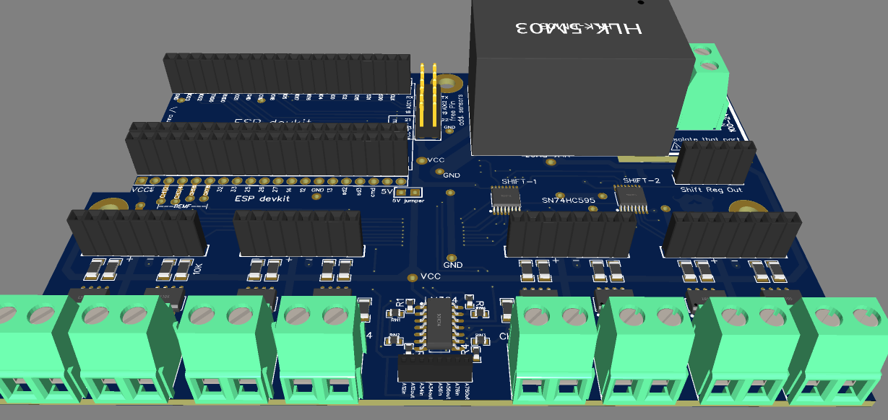
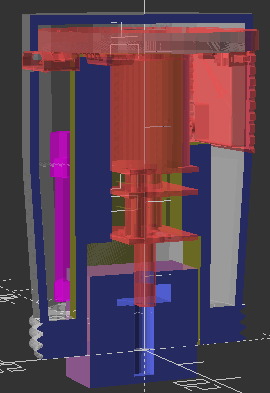
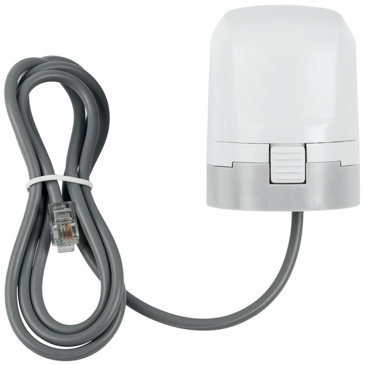

# Fabrication of your PCB Controller and Enclosure

Before you are purchasing a given release of `esp32_8ch_moter_shield` controller
board, please have a look inside the [`Images`](./imgs) folder. You
should prefere to order the latest stable release-version. To allow
generic cabeling to valve actuators, the controller board did exchange
the former RJ11 plugs in favor of screw terminals since
[version 58](./imgs/v58_rev_1.49.jpg).

It is possible to link multiple boards via the [**shift reg out pins**](./shiftregOut.md).
The ready to go board can be produced for less than 30$.

The board is designed to act and substitute a
 Floor Heating Controller:
  [`HmIP-FALMOT-C12`](https://homematic-ip.com/de/produkt/fussbodenheizungscontroller-12-fach-motorisch). This controller is about 210$.

## Enclosures / Controller Cases

Have a look at the [`Boxing`](./box) directory. Yo uwill find 3D
printable models (STL files), to print out a working cases for supported
`esp32_8ch_moter_shield` controllers.

Just to give you an idea, the following pictures show the top and bottom cases suitable for version 57

If you are unfamiliar with the 3D Printing, have a look at
[3D Printing Overview](https://3dprinting.com/what-is-3d-printing)
to get an idea on how it works. You may use your own 3D printer or make
use of a commercial service.

## Supported valves

You may choose from the list of following supported valves to contol your floor heating cirquits:

- The upcoming
  [`DIY proportional valves`](https://github.com/nliaudat/floor-heating-proportional-valve):
  A smart proportional actuator (TRV) with ESP-C3 mcu.
  
  - Pricing: aprox 8.8$ each

-  Floor Heating Actuator:
  [`HmIP-VDMOT`](https://de.elv.com/homematic-ip-stellantrieb-motorisch-fuer-fussbodenheizung-hmip-vdmot-153309).
  
  - Pricing: approx 15$ each
  - Please consult [VDMOT-Wirering](./VDMOT_wiring.md) document, that explains
  how to cut and connect the RJ11 equipted cables.

## Order via JLPCB

Before you can place an order, you have to register or login to your
JLPCB account. Please consult the official JLPCB order guide:
[How to place an Order](https://jlcpcb.com/help/article/54-How-do-I-place-an-order).

* The PCB can be ordered **with chips assembled** at JLPCB
  Pricing: approx 5.8$/unit.
  (**Warning**: You have to isolate the AC part with tape)

* The 3.3v power (or 5v) can be HKL-5MX or HKL-PMX
  Pricing: approx 2.75$
* ESP32-WROOM-32D
  Pricing: approx 3.8$

## Power Adapters

### Shield

* accept a wide supply voltage range from 3.3V to 12V
* 800mA continuous current output capability per channel
* peak current capability up to 2.0A

### AC Power

The Controller itself will need an 3.3 Volt AC Power input.

To power the onboard ESP8266 assemble the board from any of the
following step-down power supply modules:

- Hi-Link [HKL-5M03](./imgs/HLK-5M03.jpg): Input 100-240VAC/50-60Hz; Output 3.3VDC/5W
- Hi-Link 3W [HKL-PM03](./imgs/hlk-pm03.jpg): Input 100-240VAC/0.1A/50-560Hz; Output 3.3VDC/0.9A/5W
- anything else suitable

### DC Power
You can supply any DC-DC buck converter step down module.
